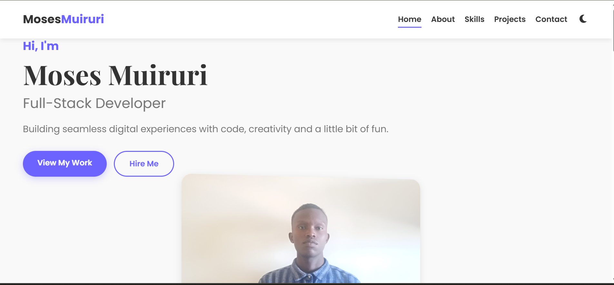
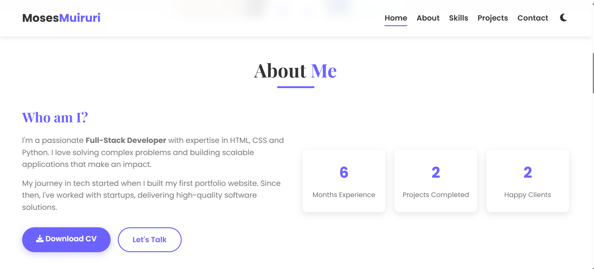
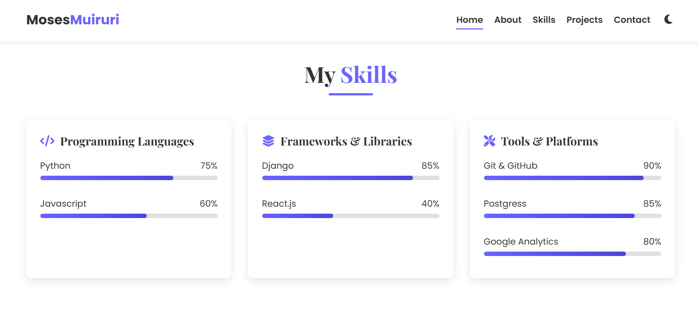
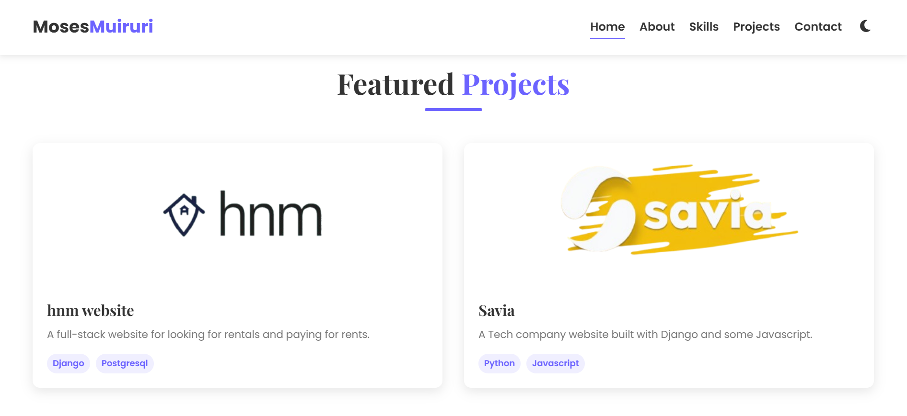
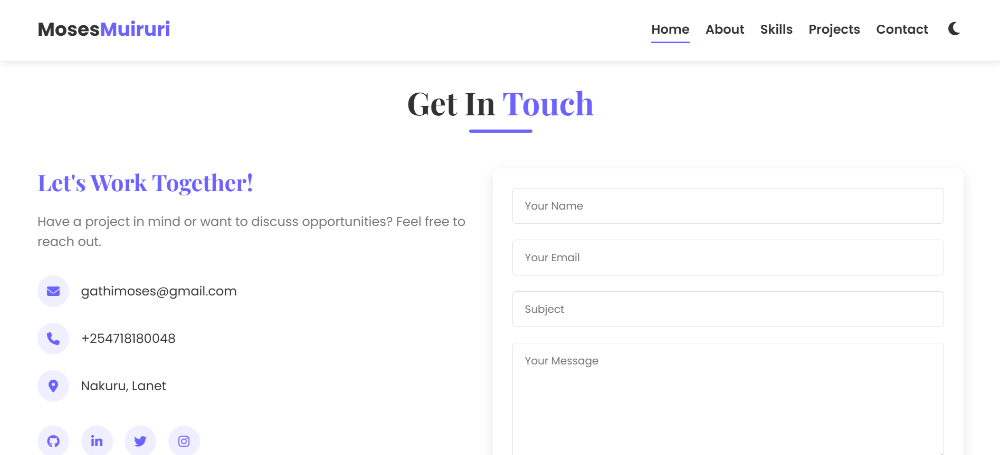

# Moses Muiruri | Full-Stack Developer

Welcome to my portfolio website! This project showcases my skills, experience, and projects in full-stack development. The website is designed with a modern UI and provides insights into my technical expertise.

## 🚀 Live Demo
[View Portfolio](https://moses-muiruri.netlify.app)

## 📸 Screenshots
### Homepage


### About Section


### Skills Section


### Projects Section


### Contact Section


## 📌 Features
- Responsive Design 🌍
- Smooth Animations ✨
- Contact Form 📩
- Showcased Projects 🛠️
- Downloadable Resume 📄

## 🛠️ Tech Stack
- **Frontend**: HTML, CSS, JavaScript
- **Frameworks & Libraries**: FontAwesome, Google Fonts
- **Deployment**: Netlify

## 🔗 Links
- Portfolio: [moses-muiruri.netlify.app](moses-muiruri.netlify.app)
- GitHub Repo: [github.com/serving-tech/moses](https://github.com/serving-tech/portfolio)
- LinkedIn: [linkedin.com/in/moses-gathigi](https://www.linkedin.com/in/moses-gathigi)

## 📄 Installation & Setup
To run this project locally, follow these steps:

1. Clone the repository:
   ```sh
   git clone https://github.com/serving-tech/moses.git
   
2. Open `index.html` in your browser.


